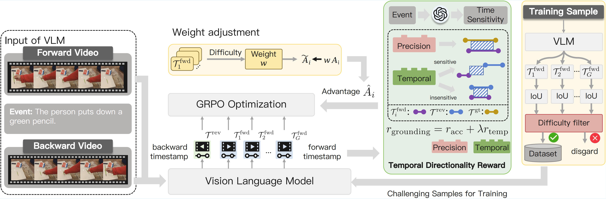

# ArrowGEV: Grounding Events in Video via Learning the Arrow of Time

We study the temporal directionality problem in Grounding Events in Videos. Specifically, we enable Vision-Language Models to capture the intrinsic temporal structure of events by distinguishing between time-sensitive and time-insensitive semantics. In this work, we utilize a reinforcement learning framework to optimize the model's policy and design a temporal directionality reward to ensure the effective discrimination of event validity across forward and reversed videos.

<div style='display:flex; gap: 0.25rem;'>
  <a href='https://arxiv.org/pdf/2601.06559'></a>
  <a href='https://huggingface.co/ParadiseYu/ArrowGEV-7B'></a>
  <a href='https://huggingface.co/datasets/ParadiseYu/ArrowGEV-Data'></a>
</div>

<p align="center" width="100%">
<a target="_blank"></a>
</p>

## Contents
- [Overview](#overview)
- [Setup](#setup)
- [Dataset](#dataset)
- [Training](#training)

## Overview

ArrowGEV builds on Qwen2.5-VL and optimizes a policy with Group Relative Policy Optimization (GRPO) using a temporal directionality reward. For each training sample, we generate predictions on both the forward video and its reversed counterpart and compute:

- An **IoU reward** that measures how well the predicted window matches the ground-truth window.
- A **temporal-directionality reward** that penalizes windows that remain valid under time reversal for time-sensitive events, and rewards consistent windows for time-insensitive events. Sensitivity is taken directly from the pre-annotated `sensitive` field in the training data.
- A **format reward** that enforces the `<think>...</think><answer>start to end</answer>` output structure.

The trainer is implemented in [src/arrowgev/rl/arrowgev_trainer.py](src/arrowgev/rl/arrowgev_trainer.py).

## Setup

Clone the repository and create a fresh environment:

```bash
git clone https://github.com/Yu-Fangxu/ArrowGEV.git
cd ArrowGEV

conda create -n ArrowGEV python=3.10.12 -y
conda activate ArrowGEV

pip install -r requirements.txt
```

Key pinned versions (CUDA 12.4): `torch==2.6.0`, `transformers==4.51.1`, `vllm==0.8.4`, `trl==0.17.0`, `numba==0.61.2`. See [docs/INSTALL.md](docs/INSTALL.md) for details — these versions matter for both training and vLLM inference.

## Dataset

Follow [docs/DATA.md](docs/DATA.md) to download and organize the training data. The default layout expected by the scripts is:

```
dataset/
└── ArrowGEV/
    ├── annotations/train_2k5.json
    └── videos/arrowgev_data/
```

Annotations and videos are published as [ParadiseYu/ArrowGEV-Data](https://huggingface.co/datasets/ParadiseYu/ArrowGEV-Data), and can also be reassembled from the original source datasets ([VTG-IT](https://huggingface.co/datasets/Yongxin-Guo/VTG-IT), [TimeIT](https://huggingface.co/datasets/ShuhuaiRen/TimeIT), [HTStep](https://openreview.net/pdf?id=vv3cocNsEK), [LongVid](https://huggingface.co/datasets/OpenGVLab/LongVid)).

Reversed-video copies are required for the temporal directionality reward. Generate them once with:

```bash
python reverse_video.py \
    --input_folder  dataset/ArrowGEV/videos/arrowgev_data \
    --output_folder dataset/ArrowGEV/videos/arrowgev_data
```

## Training

```bash
bash scripts/posttrain/train.sh
```

## Citation

If you find our work useful, please consider citing:

```bibtex
@article{yu2026arrowgev,
  title={ArrowGEV: Grounding Events in Video via Learning the Arrow of Time},
  author={Yu, Fangxu and Lu, Ziyao and Niu, Liqiang and Meng, Fandong and Zhou, Jie},
  journal={arXiv preprint arXiv:2601.06559},
  year={2026}
}
```
